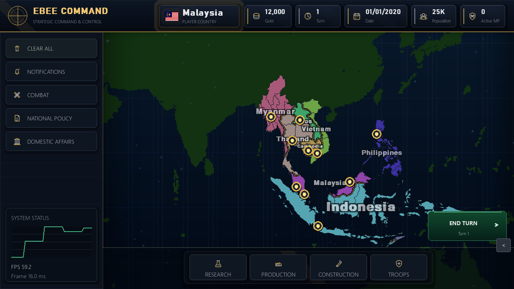
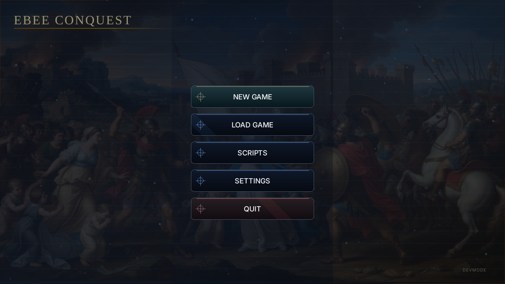

<p align="center">
  
</p>

<h1 align="center">Ebee Conquest</h1>

<p align="center">
  A Windows-only, turn-based grand strategy sandbox built with Python and Pygame.
</p>

<p align="center">
  <a href="https://github.com/mrhmmu/ebee-conquest/actions/workflows/python-app.yml"></a>
  
  
  
  <a href="LICENSE"></a>
</p>

Ebee Conquest is a 2D strategy game set across Southeast Asia. Choose one of 11 countries, manage its economy and domestic affairs, research new capabilities, command armies across a province-level SVG map, and negotiate peace when a nation capitulates.

The game combines deterministic strategic AI with optional LLM-backed negotiation. It remains playable without an internet connection through its graph-based AI mode.

> [!IMPORTANT]
> Ebee Conquest currently supports Windows only and is under active development. Save formats, balance, and unfinished interfaces may change.

## Screenshots

### Campaign map



The current command interface includes national resources, notifications, combat, national policy, domestic affairs, research, production, construction, troops, and the turn controls.

### Main menu



The main menu provides campaign creation, save loading, script management, settings, and first-run AI configuration.

## Current features

- Province-level Southeast Asia map rendered from SVG geometry.
- 11 playable countries with flags, capitals, leaders, state data, and distinct map colors.
- Terrain-aware A* pathfinding, troop movement, combat, occupations, and capitulation.
- Frontline divisions with troop assignment, rebalancing, and optional auto-advance.
- Turn-based gold, population, recruitment, political power, action points, and stability.
- Rule-based NPC recruitment, defense, invasion planning, and country personalities.
- Malaysia national focus tree and a multi-category research system.
- Domestic politics and COVID-era health-policy simulation.
- Peace conferences with validated demands, territory transfers, counteroffers, and AI dialogue.
- JSON save slots with load support from the main menu.
- Restricted Python scripting API with events and custom UI elements.
- ESO geometry and province-graph caches for faster startup.
- Fullscreen, audio, AI-mode, and cache controls.

## Quick start

### Requirements

- Windows 10 or Windows 11.
- Python 3.10 or newer.
- A working pip installation.

### Install and run

```powershell
git clone https://github.com/mrhmmu/ebee-conquest.git
cd ebee-conquest
python -m pip install -r requirements.txt
python main.py
```

You can also launch `game.bat` from File Explorer.

> [!WARNING]
> This project requires `pygame-ce`, not the separate `pygame` package. If both are installed, remove stock Pygame and reinstall the requirements:
>
> ```powershell
> python -m pip uninstall pygame
> python -m pip install -r requirements.txt
> ```

## AI modes

AI mode is selected during first-run setup and can be changed later in Settings.

| Mode | Connection | Behavior |
| --- | --- | --- |
| Online | Internet | Uses the configured OpenAI-compatible endpoint for free-form peace negotiation. |
| Ollama | Local service | Uses an OpenAI-compatible Ollama endpoint, defaulting to `http://localhost:11434/v1`. |
| Graph-based | None | Deterministic offline policy with preset dialogue choices and no API dependency. |

Strategic NPC turns—recruitment, defense, movement, and invasions—are handled by the local NPC director. LLM output is constrained and validated before it can alter treaty state.

## How a campaign works

1. Choose a country from the strategic map.
2. Select provinces and organize troops or frontline divisions.
3. Spend resources on recruitment, research, construction, and national policy.
4. End the turn to process movement, combat, the economy, domestic systems, and NPC decisions.
5. Occupy enemy territory and negotiate a validated peace settlement after capitulation.

Press `Esc` during a campaign to open Save, Settings, Quit to Main Menu, and Quit Game. Press `Space` to end the current turn.

## Scripts

Python files in `scripts/` are loaded automatically unless their filename begins with `_`. Each script exposes an `onload(api)` entry point and runs with restricted builtins—there is no unrestricted import or file access.

The safe API supports:

- Economy and troop changes.
- War declarations and province ownership/controller updates.
- Gameplay event subscriptions.
- Script notifications.
- Custom panels, buttons, draw callbacks, and click callbacks.

See [scripts/guide.txt](scripts/guide.txt) for the complete API and examples.

## Project structure

```text
main.py                    Application entrypoint
game/menu_gui.py           Main menu, setup, settings, and save selection
game/ingame_ui.py          Campaign HUD and pause/settings interfaces
game/peace_ui.py           Peace conference and negotiation UI
game/focustree.py          National focus model
engine/runtime.py          Main game loop, rendering, input, and campaign state
engine/movement.py         Pathfinding, movement, combat, and frontlines
engine/economy.py          Turn economy and recruitment costs
engine/npc/                Deterministic strategic NPC systems
engine/ai/                 Online, Ollama, and graph-based negotiation providers
engine/savegame.py         JSON save-slot serialization
engine/scriptloader.py     Restricted user-script runtime
map/                       SVG maps and country data
scripts/                   Auto-loaded user scripts and API guide
```

`engine/runtime.py` is currently the central runtime and owns most live campaign state. Avoid top-level cross-imports between engine modules; the project uses deferred imports to prevent circular dependencies.

## Development

Install the development tools, then run the same checks used by CI:

```powershell
python -m pip install pytest flake8
pytest
flake8 . --count --select=E9,F63,F7,F82 --show-source --statistics
flake8 . --count --exit-zero --max-complexity=10 --max-line-length=127 --statistics
```

Tests currently live under `.playground_testing/`. The GitHub Actions workflow runs on Python 3.10.

### Developer mode

Setting `dev.txt` in the repository root to `true` enables the in-game developer console and development indicators. Press the backtick key to open the console. Remove the file or change its value for production builds.

### ESO cache

Parsed map geometry and province adjacency are cached in `.ebee_super_optimization/` directories. If map data changes or startup fails after a map edit, use **Settings → Remove Cache** or delete those cache directories before relaunching.

## Known limitations

- Windows-only runtime due to native DPI handling.
- The campaign runtime is still monolithic and is being progressively modularized.
- National focus content is currently concentrated on Malaysia.
- Some production and construction interfaces remain under development.
- Automated tests are not yet comprehensive.

## License

Ebee Conquest is available under the [MIT License](LICENSE).
